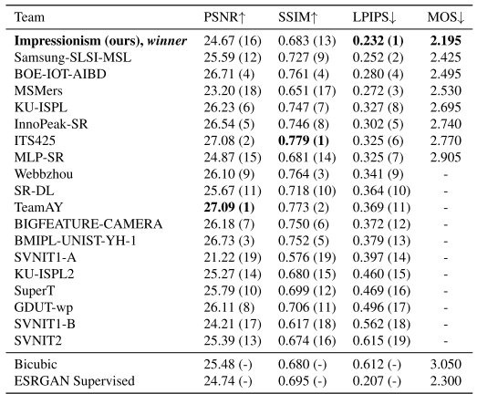
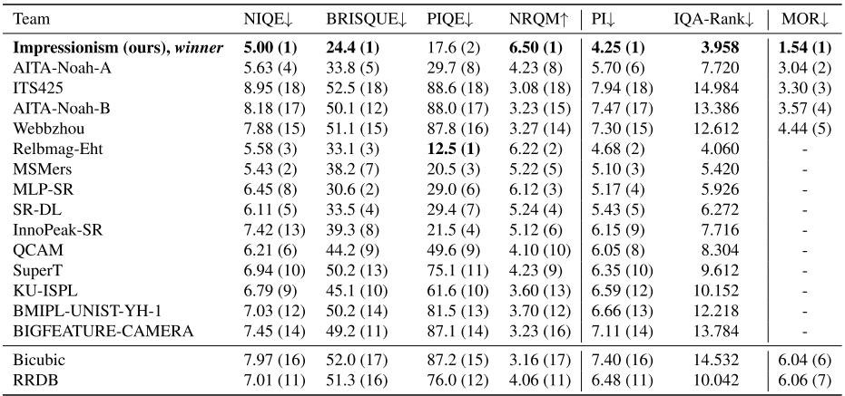
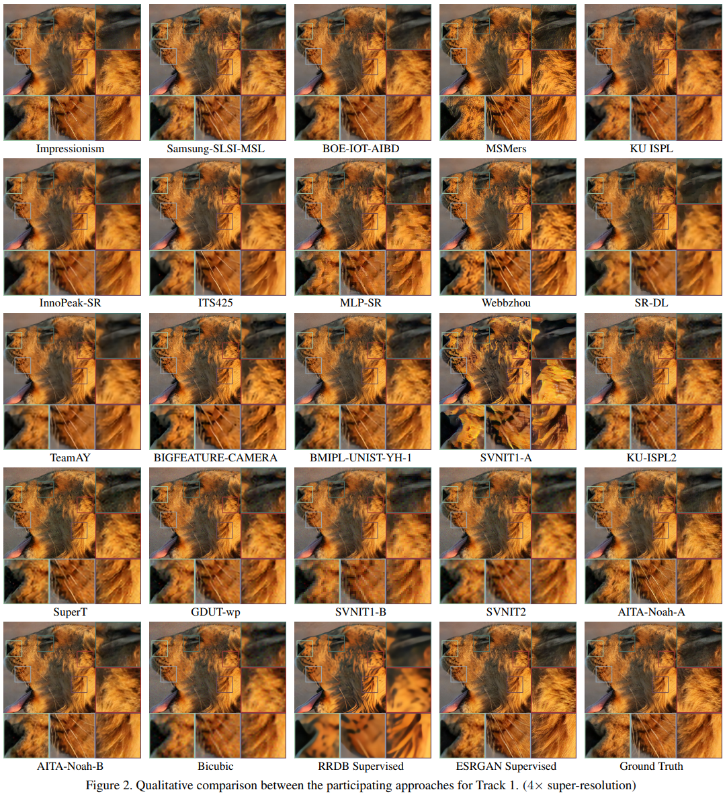
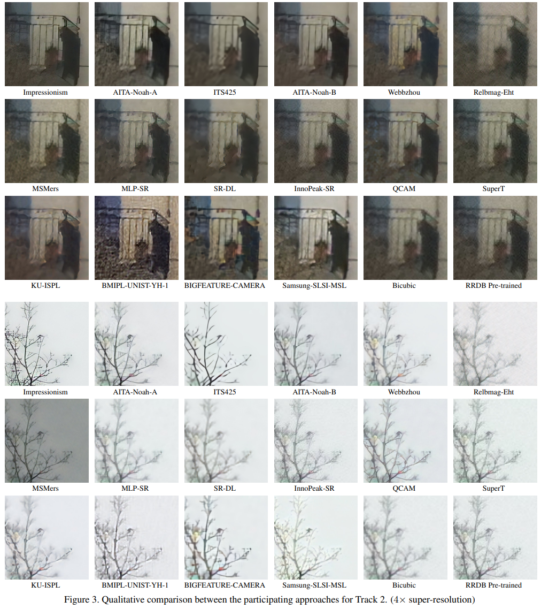

# Real-SR-Variant

## Update - November 2, 2020
- Add DWUnet, performance improvement

## Init - Actober 16, 2020
- Init repository from [RealSR](https://github.com/Tencent/Real-SR)

# Quantitative Results Compared with Other Participating Methods [RealSR]

'Impressionism' is our team. Note that the final decision is based on MOS (Mean Opinion Score) and MOR (Mean Opinion Rank).





# Qualitative Results Compared with Other Participating Methods [RealSR]

'Impressionism' is our team. 






## Dependencies and Installation
This code is based on [BasicSR](https://github.com/xinntao/BasicSR).

- Python 3 (Recommend to use [Anaconda](https://www.anaconda.com/download/#linux))
- [PyTorch >= 1.0](https://pytorch.org/)
- NVIDIA GPU + [CUDA](https://developer.nvidia.com/cuda-downloads)
- Python packages: `pip install numpy opencv-python lmdb pyyaml`
- TensorBoard: 
  - PyTorch >= 1.1: `pip install tb-nightly future`
  - PyTorch == 1.0: `pip install tensorboardX`

## Pre-trained models
- Models for challenge results
    - [DF2K](https://drive.google.com/open?id=1pWGfSw-UxOkrtbh14GeLQgYnMLdLguOF) for corrupted images with processing noise.
    - [DPED](https://drive.google.com/open?id=1zZIuQSepFlupV103AatoP-JSJpwJFS19) for real images taken by cell phone camera.
- Extended models
    - [DF2K-JPEG](https://drive.google.com/open?id=1w8QbCLM6g-MMVlIhRERtSXrP-Dh7cPhm) for compressed jpeg image. 
 
## Testing
Download dataset from [NTIRE 2020 RWSR](https://competitions.codalab.org/competitions/22220#participate) and unzip it to your path.

For convenient, we provide [Corrupted-te-x](https://drive.google.com/open?id=1GrLxeE-LruddQoAePV1Z7MFclXdZWHMa) and [DPEDiphone-crop-te-x](https://drive.google.com/open?id=19zlofWRxkhsjf_TuRA2oI9jgozifGvxp).

```cd ./codes```

### DF2K: Image processing artifacts
 1. Modify the configuration file options/df2k/test_df2k.yml
     - line 1 : 'name' -- dir name for saving the testing results
     - line 13 : 'dataroot_LR' -- test images dir
     - line 26 : 'pretrain_model_G' -- pre-trained model for testing
 2. Run command :
 ```CUDA_VISIBLE_DEVICES=X python3 test.py -opt options/df2k/test_df2k.yml ```
 3. The output images is saved in '../results/'
 
### DPED: Smartphone images 
 1. Modify the configuration file options/dped/test_dped.yml
    - line 1 : 'name' -- dir name for saving the testing results
    - line 13 : 'dataroot_LR' -- test images dir
    - line 26 : 'pretrain_model_G' -- pre-trained model for testing
 2. Run command :
 ```CUDA_VISIBLE_DEVICES=X python3 test.py -opt options/dped/test_dped.yml```
 3. The output images is saved in '../results/'
 

## Training

### Track 1
 1. prepare training data
    - specify dataset paths in './preprocess/path.yml' and create bicubic dataset :
    ```python3 ./preprocess/create_bicubic_dataset.py --dataset df2k --artifacts tdsr```

    - run the below command to collect high frequency noise from Source :
    ```python3 ./preprocess/collect_noise.py --dataset df2k --artifacts tdsr```
    
 2. train SR model
    - Modify the configuration file options/df2k/train_bicubic_noise.yml
    - Run command :
    ```python3 train.py -opt options/df2k/train_bicubic_noise.yml```
    - checkpoint dir is in '../experiments'
    
### Track 2
 1. prepare training data
    - Use [KernelGAN](https://github.com/sefibk/KernelGAN) to generate kernels from source images. Clone the repo here. Replace SOURCE_PATH with specific path and run :
        ``` 
      cd KernelGAN
      python3 train.py --X4 --input-dir SOURCE_PATH
        ```
    
    - specify dataset paths in './preprocess/path.yml' and generated KERNEL_PATH to kernel create kernel dataset:
    ```python3 ./preprocess/create_kernel_dataset.py --dataset dped --artifacts clean --kernel_path KERNEL_PATH```

    - run the below command to collect high frequency noise from Source:
    ```python3 ./preprocess/collect_noise.py --dataset dped --artifacts clean```
    
 2. train SR model
    - Modify the configuration file options/dped/train_kernel_noise.yml
    - run command :
    ```python3 train.py -opt options/dped/train_kernel_noise.yml```
    - checkpoint dir is in '../experiments'
 
 
